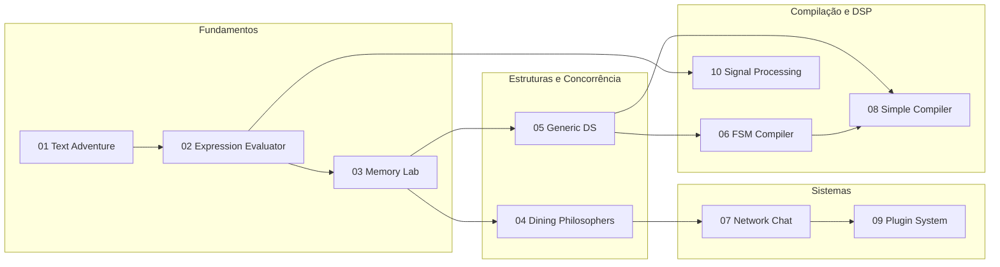

# Exercícios de C — Programação Avançada

Repositório de laboratórios práticos para aprofundar **C e C++** além do básico: memória dinâmica, concorrência, estruturas de dados genéricas, redes, compilação, plugins dinâmicos e processamento de sinais. Cada exercício traz objetivo, requisitos, conceitos a praticar, abordagem sugerida e ideias de extensão.

Ideal para quem já domina sintaxe e tipos e quer treinar **engenharia de software de baixo nível** com projetos guiados e crescente complexidade.

---

## Índice

- [Visão geral](#visão-geral)
- [Pré-requisitos](#pré-requisitos)
- [Estrutura do repositório](#estrutura-do-repositório)
- [Trilha de exercícios](#trilha-de-exercícios)
- [Como estudar cada laboratório](#como-estudar-cada-laboratório)
- [Soluções incluídas](#soluções-incluídas)
- [Mapa de conceitos](#mapa-de-conceitos)
- [Ferramentas recomendadas](#ferramentas-recomendadas)
- [Contribuindo](#contribuindo)
- [Licença](#licença)

---

## Visão geral

| Aspecto | Descrição |
|--------|-----------|
| **Formato** | 10 enunciados em Markdown (`01`–`10`) |
| **Linguagens** | C (foco principal) e C++ (solução de referência do exercício 1) |
| **Nível** | Intermediário a avançado |
| **Soluções** | Parcial — [Exercício 1](SOLUTIONS/01-enhanced-text-adventure/) implementado |
| **Objetivo** | Consolidar tópicos típicos de sistemas, algoritmos e engenharia de software |

Os exercícios foram pensados como uma **progressão**: começam com I/O, memória e modularização; passam por parsing, sincronização e estruturas genéricas; e culminam em compilação, plugins e processamento em tempo real.

---

## Pré-requisitos

- Compilador **GCC** ou **Clang** (`gcc`, `g++`)
- `make` e ferramentas de build básicas
- Familiaridade com ponteiros, structs e alocação dinâmica
- Para exercícios específicos:
  - **Threads**: POSIX threads (`pthread`) ou equivalente
  - **Rede**: sockets BSD (Linux/macOS) ou Winsock (Windows)
  - **Plugins**: `dlopen` / `dlsym` (POSIX) ou `LoadLibrary` (Windows)
  - **Memória**: Valgrind ou AddressSanitizer (recomendado no exercício 3)
  - **Áudio/sinais** (exercício 10): noções de amostragem e filtros digitais

---

## Estrutura do repositório

```
Exercicios-de-C/
├── README.md                          # Este arquivo
├── 01-enhanced-text-adventure.md      # Aventura textual com memória dinâmica
├── 02-expression-evaluator.md         # Calculadora com precedência de operadores
├── 03-memory-management-lab.md        # Laboratório de gerenciamento de memória
├── 04-concurrent-dining-philosophers.md
├── 05-generic-data-structures.md
├── 06-finite-state-machine-compiler.md
├── 07-networked-chat-application.md
├── 08-simple-language-compiler.md
├── 09-plugin-system.md
├── 10-real-time-signal-processing.md
└── SOLUTIONS/
    └── 01-enhanced-text-adventure/    # Solução de referência (C++)
        ├── src/
        ├── locations.txt
        ├── items.txt
        ├── Makefile
        └── README.md
```

Cada arquivo `NN-nome.md` na raiz é um **enunciado autocontido**. Implemente seu código em pastas próprias (por exemplo `meu-trabalho/02-evaluator/`) ou contribua com novas soluções em `SOLUTIONS/`.

---

## Trilha de exercícios

### 01 — Aventura textual aprimorada

**Arquivo:** [`01-enhanced-text-adventure.md`](01-enhanced-text-adventure.md)

Estender um mundo de texto com **memória dinâmica**, leitura de locais por arquivo, inventário, NPCs e save/load.

| Tópicos | I/O de arquivos, `malloc`/`realloc`/`free`, structs, modularização |
| Dificuldade | ★★☆☆☆ |

---

### 02 — Avaliador de expressões

**Arquivo:** [`02-expression-evaluator.md`](02-expression-evaluator.md)

Calculadora de linha de comando com `+`, `-`, `*`, `/`, `%`, parênteses, inteiros e ponto flutuante, respeitando **precedência e associatividade**.

| Tópicos | Shunting Yard ou descida recursiva, pilhas, árvores de expressão |
| Dificuldade | ★★★☆☆ |

---

### 03 — Laboratório de gerenciamento de memória

**Arquivo:** [`03-memory-management-lab.md`](03-memory-management-lab.md)

Allocator customizado (first-fit, best-fit), demonstrações de vazamentos, buffer overflow, use-after-free, double free e um **coletor de lixo** simples.

| Tópicos | Segurança de memória, pools, Valgrind/ASan |
| Dificuldade | ★★★★☆ |

---

### 04 — Filósofos jantantes (concorrência)

**Arquivo:** [`04-concurrent-dining-philosophers.md`](04-concurrent-dining-philosophers.md)

Implementar o problema clássico com threads, evitando **deadlock** e **starvation**; comparar mutex, semáforos e hierarquia de recursos.

| Tópicos | `pthread`, mutex, semáforos, condições de corrida |
| Dificuldade | ★★★★☆ |

---

### 05 — Biblioteca de estruturas de dados genéricas

**Arquivo:** [`05-generic-data-structures.md`](05-generic-data-structures.md)

Lista encadeada, tabela hash e árvore binária de busca usando **`void*`** e **function pointers** para compare/copy/free.

| Tópicos | Programação genérica em C, callbacks, rehash |
| Dificuldade | ★★★★☆ |

---

### 06 — Compilador de máquinas de estado finitas

**Arquivo:** [`06-finite-state-machine-compiler.md`](06-finite-state-machine-compiler.md)

Linguagem para descrever FSMs e **geração de código C** (tabela de transições, ações de entrada/saída, guards).

| Tópicos | Lexer, parser, geração de código, autômatos |
| Dificuldade | ★★★★★ |

---

### 07 — Chat em rede

**Arquivo:** [`07-networked-chat-application.md`](07-networked-chat-application.md)

Servidor TCP multicliente, salas públicas, mensagens privadas e autenticação básica.

| Tópicos | Sockets, `select`/`poll` ou threads, protocolo de aplicação |
| Dificuldade | ★★★★☆ |

---

### 08 — Compilador de linguagem simples

**Arquivo:** [`08-simple-language-compiler.md`](08-simple-language-compiler.md)

Linguagem mínima com expressões, atribuições, `if`/`else`, `while` e `print`; pipeline **lexer → parser → semântica → código**.

| Tópicos | AST, análise semântica, geração de assembly ou bytecode |
| Dificuldade | ★★★★★ |

---

### 09 — Sistema de plugins

**Arquivo:** [`09-plugin-system.md`](09-plugin-system.md)

Aplicação host que carrega extensões em tempo de execução via **`dlopen`** / **`dlsym`** (ou API Windows), com versionamento e descoberta.

| Tópicos | Bibliotecas dinâmicas, interfaces por ponteiros de função |
| Dificuldade | ★★★★☆ |

---

### 10 — Processamento de sinais em tempo real

**Arquivo:** [`10-real-time-signal-processing.md`](10-real-time-signal-processing.md)

Filtros FIR/IIR, FFT, efeitos de áudio e processamento por blocos com medição de latência.

| Tópicos | DSP, métodos numéricos, otimização e visualização |
| Dificuldade | ★★★★★ |

---

## Como estudar cada laboratório

1. **Leia o enunciado** — objetivo, requisitos e abordagem sugerida.
2. **Defina o escopo** — implemente os requisitos obrigatórios antes das extensões.
3. **Prototipe em C** — a maioria dos exercícios pede C puro; use C++ apenas se fizer sentido para você.
4. **Teste de forma incremental** — um requisito por commit facilita revisão e debug.
5. **Documente decisões** — um `README` curto na sua pasta de solução ajuda na revisão.
6. **Compare com a solução de referência** (quando existir) após tentar sozinho.

Sugestão de ordem para iniciantes: `01 → 02 → 03 → 05 → 04 → 07 → 09 → 06 → 08 → 10`.

---

## Soluções incluídas

### Exercício 1 — Enhanced Text Adventure (C++17)

Local: [`SOLUTIONS/01-enhanced-text-adventure/`](SOLUTIONS/01-enhanced-text-adventure/)

Implementação modular com carregamento de locais e itens por arquivo, inventário e comandos de save/load.

**Compilar e executar:**

```bash
cd SOLUTIONS/01-enhanced-text-adventure
make
make run
```

**Comandos no jogo:** `look`, `go <local>`, `inventory`, `take <item>`, `drop <item>`, `save`, `load`, `help`, `quit`.

Detalhes de formatos de arquivo (`locations.txt`, `items.txt`) e arquitetura estão no [README da solução](SOLUTIONS/01-enhanced-text-adventure/README.md).

> **Nota:** A solução de referência usa containers da STL (`vector`, `unordered_map`), que gerenciam memória dinamicamente por baixo dos panos. Para alinhar ao enunciado original em C puro, reimplemente com `malloc`/`realloc`/`free` e structs.

---

## Mapa de conceitos



| Exercício | Conceitos centrais |
|-----------|-------------------|
| 01 | I/O, memória dinâmica, modularização |
| 02 | Parsing, pilhas, precedência |
| 03 | Allocators, segurança, GC |
| 04 | Threads, deadlock, starvation |
| 05 | `void*`, function pointers, ADTs |
| 06 | Lexer, parser, code generation |
| 07 | TCP, concorrência, protocolos |
| 08 | AST, semântica, compiladores |
| 09 | `dlopen`, extensibilidade |
| 10 | FFT, filtros, tempo real |

---

## Ferramentas recomendadas

| Ferramenta | Uso |
|------------|-----|
| **GCC / Clang** | Compilação com `-Wall -Wextra -pedantic` |
| **Valgrind** (`memcheck`) | Vazamentos e erros de heap (ex. 03) |
| **AddressSanitizer** | `-fsanitize=address` em builds de debug |
| **GDB / LLDB** | Depuração passo a passo |
| **pthread** | Exercício 04 |
| **Wireshark** (opcional) | Inspecionar tráfego do chat (07) |
| **flex/bison** (opcional) | Acelerar lexer/parser nos exercícios 06 e 08 |

---

## Contribuindo

Contribuições são bem-vindas:

1. Faça um fork do repositório.
2. Crie uma branch para sua feature ou solução (`git checkout -b solucao/02-evaluator`).
3. Adicione código em `SOLUTIONS/NN-nome/` com `README`, `Makefile` e instruções de build.
4. Abra um Pull Request descrevendo o que foi implementado e como testar.

Prioridade para novas soluções: exercícios **02** a **10** ainda sem implementação de referência.

---

## Licença

Este repositório é material educacional. Consulte o autor do repositório para termos de uso específicos. Ao contribuir, você concorda em licenciar suas contribuições sob os mesmos termos do projeto.

---

**Autor:** [douglasrocha91](https://github.com/douglasrocha91)

Se este material foi útil, considere dar uma estrela no repositório e compartilhar com quem está aprendendo programação de sistemas em C.
